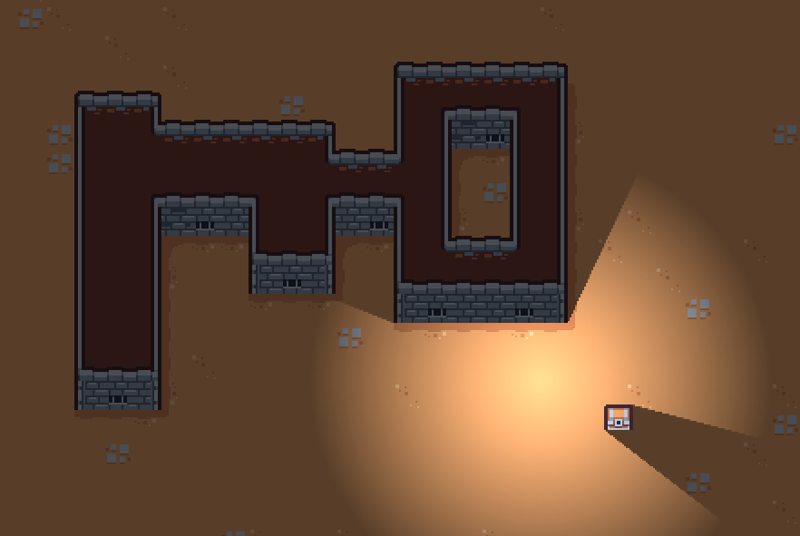
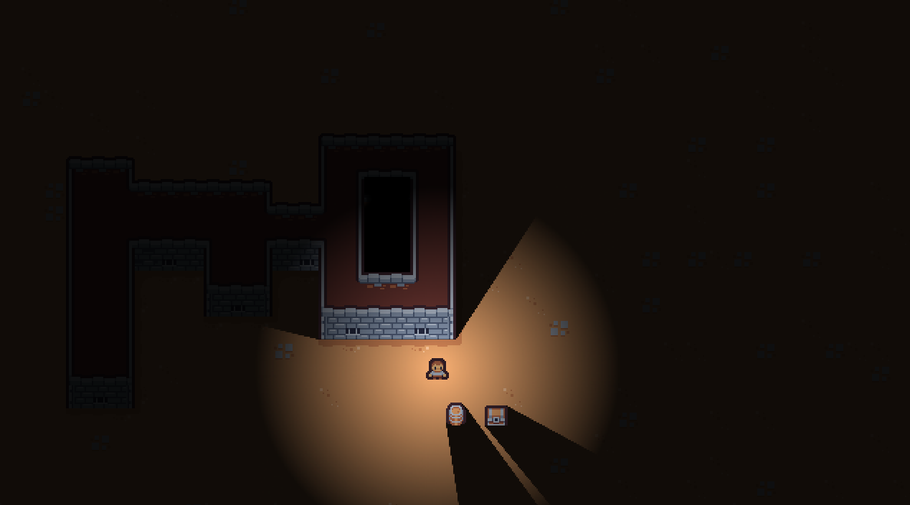
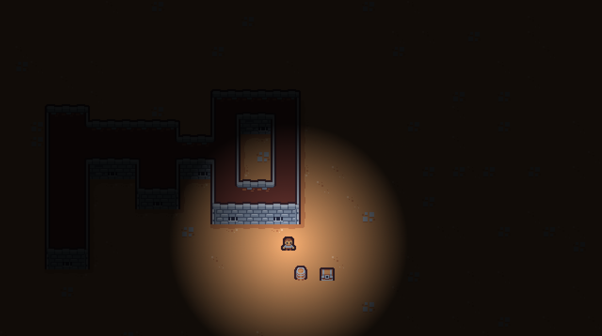
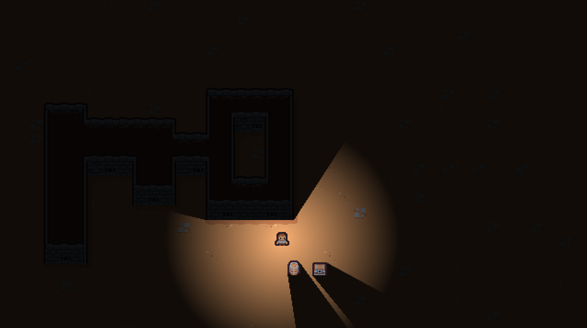

# Tiny Dungeon
A Godot 4 top-down mini RPG

Built just to test some lighting features in Godot 4.

I might expand it in the future.

* Basic occluders in chest sprite and tileset
* Simple light2d
* No normal maps
* No specular maps

Problem I'd like to solve:

* Chest sprite has cull_mode counterclockwise (so it lights up)
* Tilemap has no cull_mode option (that's why it's dark - it receives shadows)

My goal is to get this:

What I get is this:

Or this:

Art: Tiny Dungeon by [Kenney](https://www.kenney.nl/assets/tiny-dungeon)
